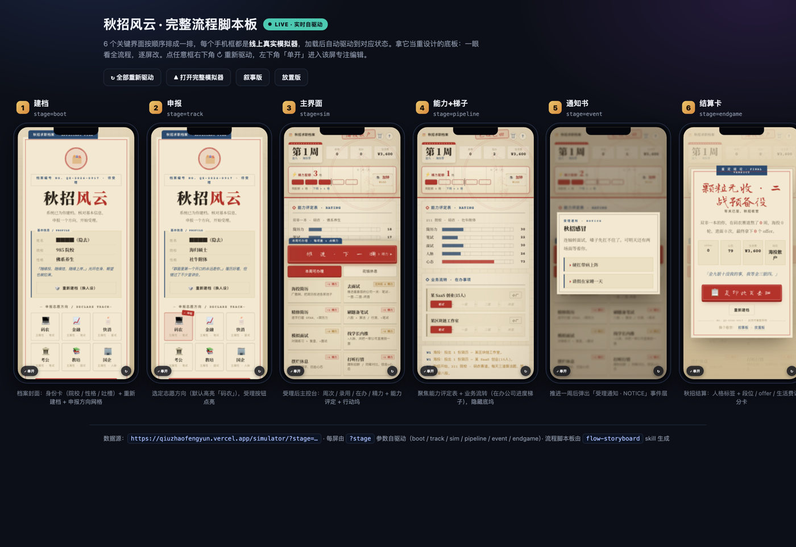

# flow-storyboard

**Lay a product's whole user flow out as a single horizontal strip of live phone
frames** — each frame an `<iframe>` of the *real running app*, auto-driven to a
different state of the journey (screen 1 → screen 2 → … → screen N).

Opening the board = watching every key screen boot itself into the right state,
all at once. It's a **living redesign baseboard**: you see how screens relate,
spot the weak one, then open just that one to edit it in isolation.

> A Claude Code / Codex **skill**. You describe the flow; the agent (or the tiny
> `build.mjs` script) emits one self-contained HTML board.



*Above: the real board built from the [秋招风云 simulator](https://qiuzhaofengyun.vercel.app/simulator/) — six live frames, each self-driven via `?stage=`.*

---

## Why this form

- **Static mockups rot** the moment the app changes. These frames are the real
  app, so the board never drifts from production.
- **A single simulator only shows one screen at a time** — you lose the shape of
  the whole journey. The board keeps the whole flow in one eye-sweep.
- **Redesign on a living baseboard**: scan boot → … → endgame, find the weak
  screen, click **单开** to open just that one full-page and edit it.

## The one hard requirement: each screen must be deep-linkable

The whole thing rests on the app being able to **self-drive to a state from a
URL**. Two common shapes:

1. **A deep-link param** — one URL plus a query key that selects state, e.g.
   `https://app/simulator/?stage=track`. (The default the build script assumes.)
2. **Distinct paths** — each screen already lives at its own URL
   (`/onboarding`, `/home`, `/notice`). Then each screen's `param` is that path.

If the app *cannot yet* reach a mid-flow state from a URL, that gap is the real
work — usually a small change: read a `?stage=` param on boot and fast-forward
the app into that state (and optionally a `&sb=1` flag to hide nav chrome).
See [`SKILL.md`](SKILL.md) for the full guidance.

## Quick start

```bash
# 1. build a board from a spec (no dependencies — pure Node)
node scripts/build.mjs examples/qiuzhaofengyun.spec.json out.html

# 2. open it
open out.html

# 3. (optional) publish a shareable variant via the talk-html skill
node scripts/build.mjs examples/qiuzhaofengyun.spec.json out.talk.html --talk
bash ~/.agents/skills/talk-html/publish.sh out.talk.html   # → gist + htmlpreview URL
```

The spec is small — see [`examples/qiuzhaofengyun.spec.json`](examples/qiuzhaofengyun.spec.json):

```json
{
  "title": "秋招风云 · 完整流程脚本板",
  "base": "https://qiuzhaofengyun.vercel.app/simulator/",
  "paramKey": "stage",
  "bootFlag": "sb=1",
  "screens": [
    { "stage": "boot",  "name": "建档", "param": "",             "desc": "档案封面 + 申报方向网格" },
    { "stage": "track", "name": "申报", "param": "?stage=track", "desc": "选定方向，受理按钮点亮" }
  ]
}
```

## Install as a Claude Code / Codex skill

```bash
git clone https://github.com/liush2yuxjtu/flow-storyboard.git
mkdir -p ~/.claude/skills/flow-storyboard
cp -R flow-storyboard/SKILL.md flow-storyboard/scripts flow-storyboard/assets \
      ~/.claude/skills/flow-storyboard/
# (Codex: same files under ~/.codex/skills/flow-storyboard/)
```

Then just talk to the agent — see the copy-to-run prompt below.

## Copy-to-run prompt

Paste this into a Claude Code / Codex session and fill the three blanks:

```
用 flow-storyboard 给我做一块「流程脚本板」。

· App 地址（已部署、可公开访问）：<在此填 App URL>
· 每屏怎么寻址：<deep-link 参数，例如 ?stage=track；或各屏自己的路径 /home /notice>
· 屏序（按用户旅程从前到后）：<例如 建档 → 申报 → 主界面 → 通知书 → 结算卡>

请按 SKILL.md 的流程：先确认每屏都能用 URL 自驱动到对应状态（不能的话先告诉我缺口、
给最小补丁），写好 spec.json，跑 scripts/build.mjs 生成 board，open 预览；
然后用 --talk 生成可分享变体，调 talk-html 的 publish.sh 发布成 gist，
最后把 rendered（htmlpreview）链接发我。
```

## What "good" looks like

- All N frames load the real app and visibly settle into *different* states. If
  two frames look identical, the deep-link param isn't actually driving them.
- The strip reads as a story left-to-right: each `name` + `desc` makes the step's
  purpose obvious to someone who's never seen the app.
- One file you can open with no server (frames point at the live URL, so the app
  must be reachable — a deployed URL, not a localhost dev server, if you publish).

## Files

| Path | What |
|---|---|
| `SKILL.md` | The skill definition the agent reads. |
| `scripts/build.mjs` | Zero-dependency builder: spec JSON → self-contained board HTML. |
| `assets/template.html` | The live phone-strip template. |
| `assets/talk-template.html` | The `--talk` shareable / publishable variant. |
| `examples/` | A real spec + the board it produces. |

## License

MIT — see [`LICENSE`](LICENSE).
